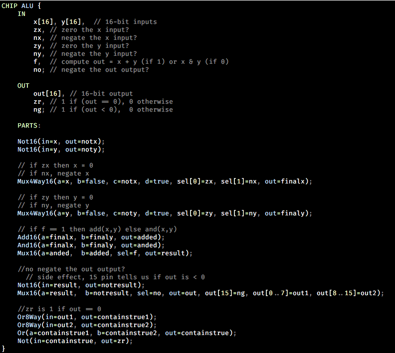

# vim nand2tetris syntax
Syntax files for the ad-hoc languages used by the [Nand2Tetris](http://www.nand2tetris.org/), or *Elements of Computing
Systems*, course, throughout which you construct a computer from the ground up. Supports the following:

  * *HDL*: a hardware-description language used to construct circuits.
  * *Hack* assembly: the *Hack* computer's assembly language.
  * *Hack* virtual machine language: the IR understood by the *Hack* virtual machine.
  * *Jack*: a high-level object-oriented language without garbage collection. Syntactically similar to Java.

## installation
If you use Pathogen:

```
cd ~/.vim/bundle
git clone https://github.com/sevko/vim-nand2tetris-syntax
```

Adapt as needed for your plugin manager of choice.


